# Benchmark Results: 3-Way Comparison

> Same marketing page. Same components. Three approaches. Radically different JavaScript footprints.

---

## TL;DR

| Metric | Astro + b/ui | Astro + React + shadcn | Next.js + shadcn | 
|---|---|---|---|
| **JS bundle (gzipped)** | **22.25 KB** | 114.47 KB | 219.19 KB |
| **JS bundle (raw)** | **58.59 KB** | 374.03 KB | 729.82 KB |
| **JS files** | **7** | 3 | 10 |
| **vs b/ui (gzip)** | **1x** | 5.1x more | 9.8x more |
| **Zero-JS components** | 7 of 13 | 0 of 13 | 0 of 13 |

---

## What each version represents

| Version | Framework | UI Library | Runtime |
|---|---|---|---|
| **Astro + b/ui** | Astro (static) | b/ui components | data-slot primitives (vanilla JS) |
| **Astro + React + shadcn** | Astro (React island) | shadcn/ui + Radix | React + ReactDOM |
| **Next.js + shadcn** | Next.js | shadcn/ui + Radix | React + ReactDOM + Next.js router |

The **Astro + React + shadcn** version isolates the cost of React itself. By running React inside Astro (as a `client:load` island), we remove the Next.js router, framework code, and RSC overhead — leaving only React + Radix.

---

## The Page

All three projects render the **exact same marketing onepager** — identical layout, identical content, identical interactive components.

### Components used (13 total)

| Component | Interactive? | Astro b/ui JS | Astro React + shadcn JS | Next.js JS |
|---|---|---|---|---|
| NavigationMenu | ✅ | 6.72 KB gzip | Bundled in ~114 KB | Bundled in ~219 KB |
| Select (×2) | ✅ | 3.67 KB gzip | Bundled in ~114 KB | Bundled in ~219 KB |
| HoverCard (×6) | ✅ | 2.29 KB gzip | Bundled in ~114 KB | Bundled in ~219 KB |
| Tooltip (×6) | ✅ | 1.98 KB gzip | Bundled in ~114 KB | Bundled in ~219 KB |
| Tabs | ✅ | 1.79 KB gzip | Bundled in ~114 KB | Bundled in ~219 KB |
| Accordion (×6) | ✅ | 1.17 KB gzip | Bundled in ~114 KB | Bundled in ~219 KB |
| Button | ❌ Static | **0 KB** | Bundled in ~114 KB | Bundled in ~219 KB |
| Card | ❌ Static | **0 KB** | Bundled in ~114 KB | Bundled in ~219 KB |
| Badge | ❌ Static | **0 KB** | Bundled in ~114 KB | Bundled in ~219 KB |
| Input | ❌ Static | **0 KB** | Bundled in ~114 KB | Bundled in ~219 KB |
| Label | ❌ Static | **0 KB** | Bundled in ~114 KB | Bundled in ~219 KB |
| Checkbox | ❌ Static | **0 KB** | Bundled in ~114 KB | Bundled in ~219 KB |
| Separator | ❌ Static | **0 KB** | Bundled in ~114 KB | Bundled in ~219 KB |

> In Astro + b/ui, **7 of 13 components ship zero JavaScript**. In both React-based versions, every component contributes to the JS bundle because the entire component tree must hydrate.

---

## Visual Comparison

All three pages use each library's default design tokens. The goal is realistic usage, not pixel-perfect parity.

### Hero Section

````carousel
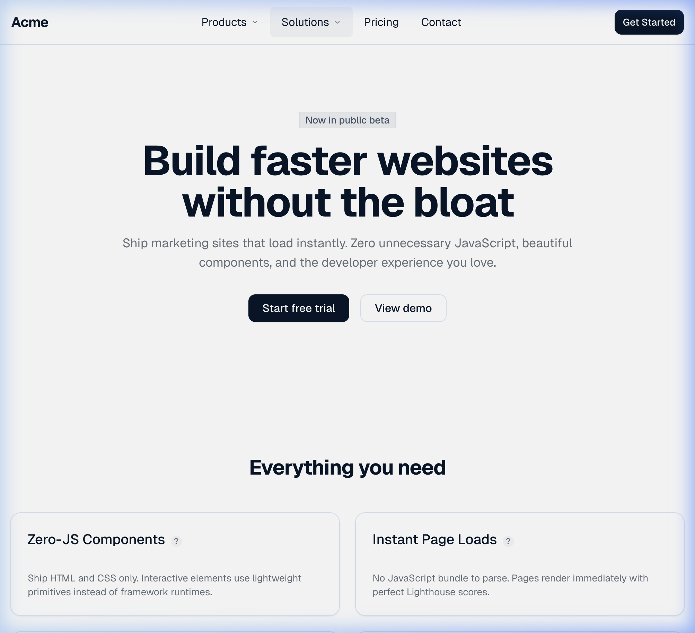
<!-- slide -->
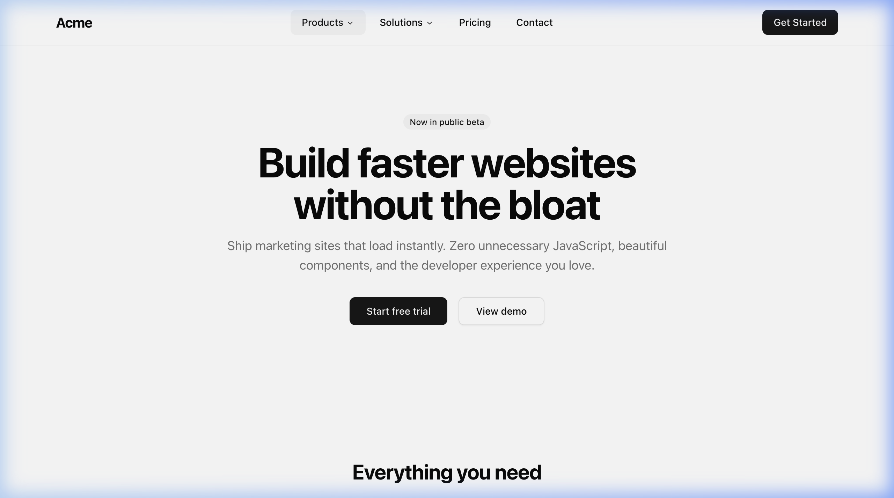
````

### Features (Cards with Tooltips)

````carousel
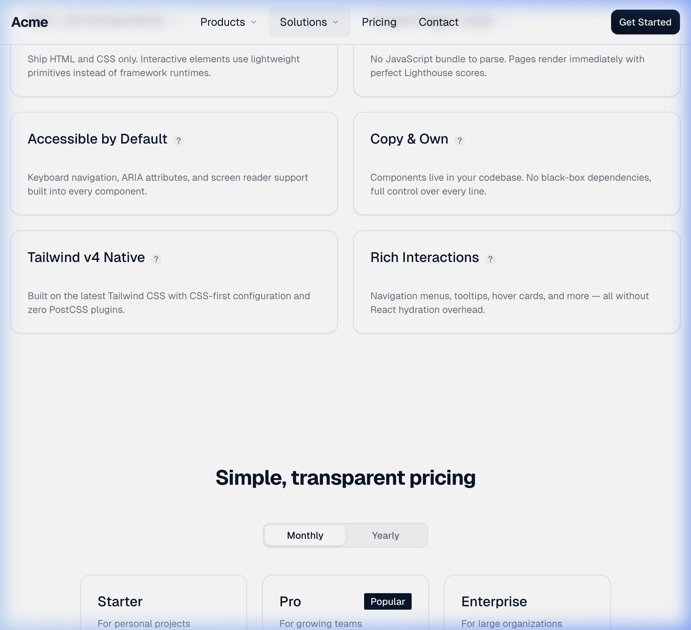
<!-- slide -->
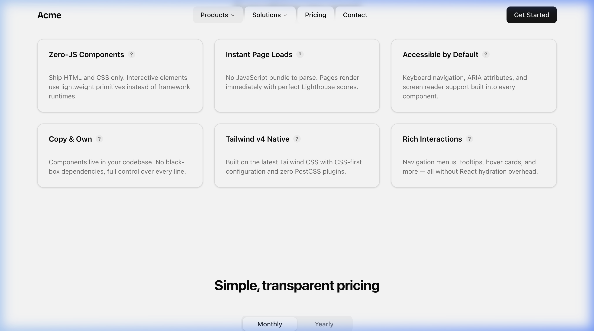
````

### Pricing (Tabs)

````carousel
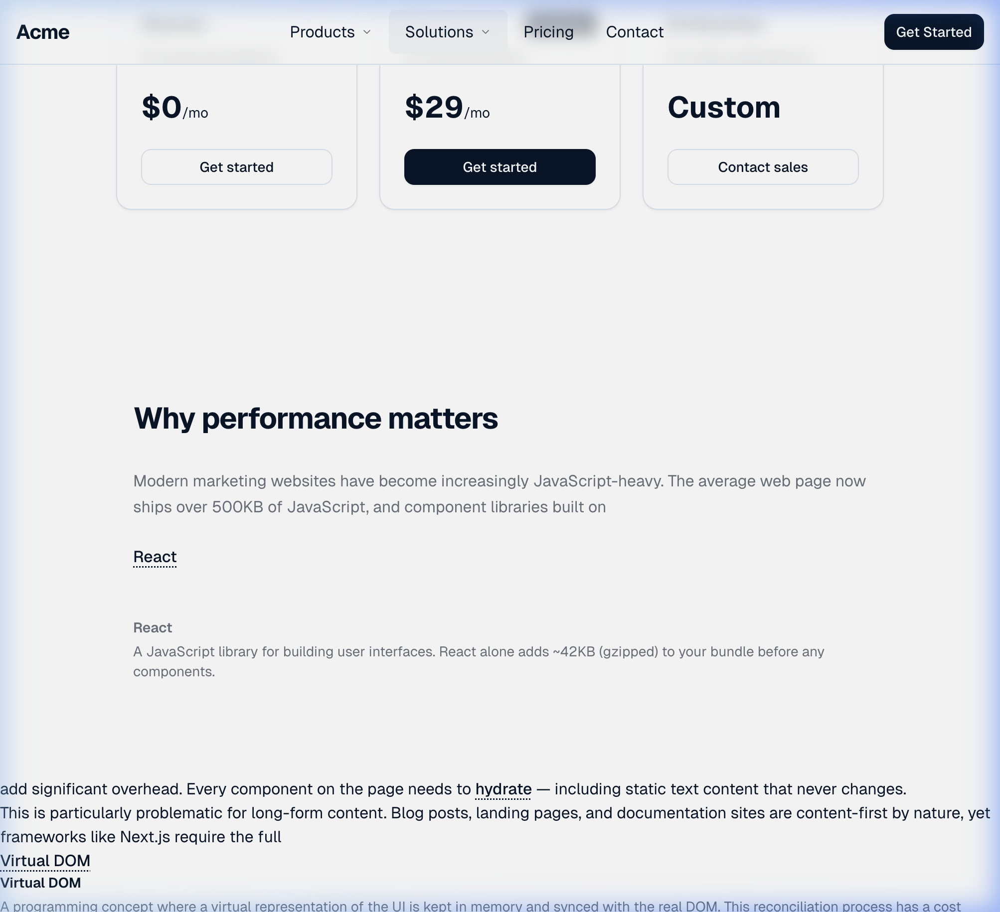
<!-- slide -->
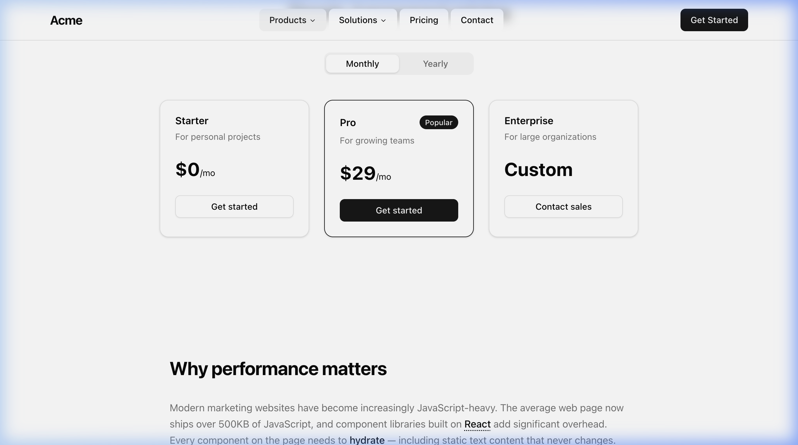
````

### Long-form Text (with inline HoverCards)

````carousel
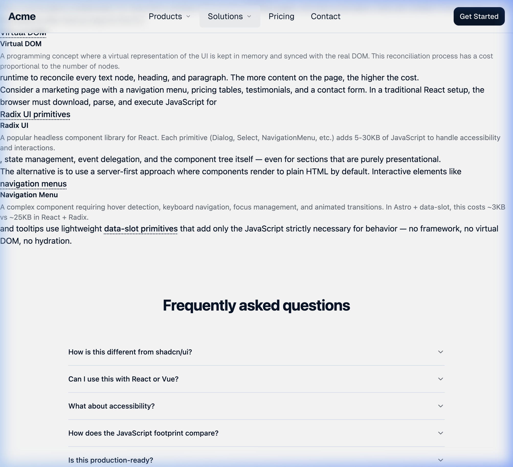
<!-- slide -->
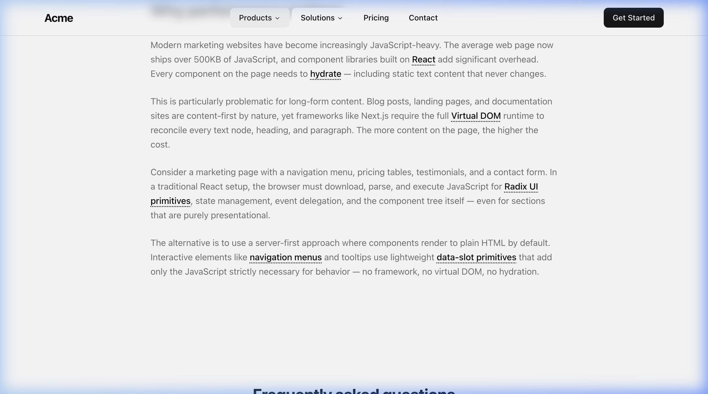
````

### FAQ (Accordion)

````carousel

<!-- slide -->
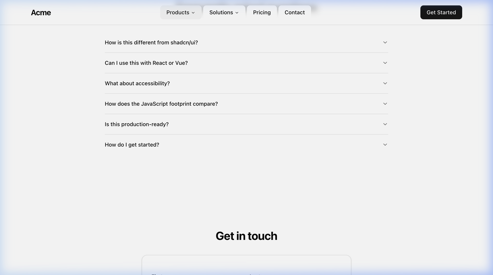
````

### Contact Form (Select, Input, Checkbox)

````carousel
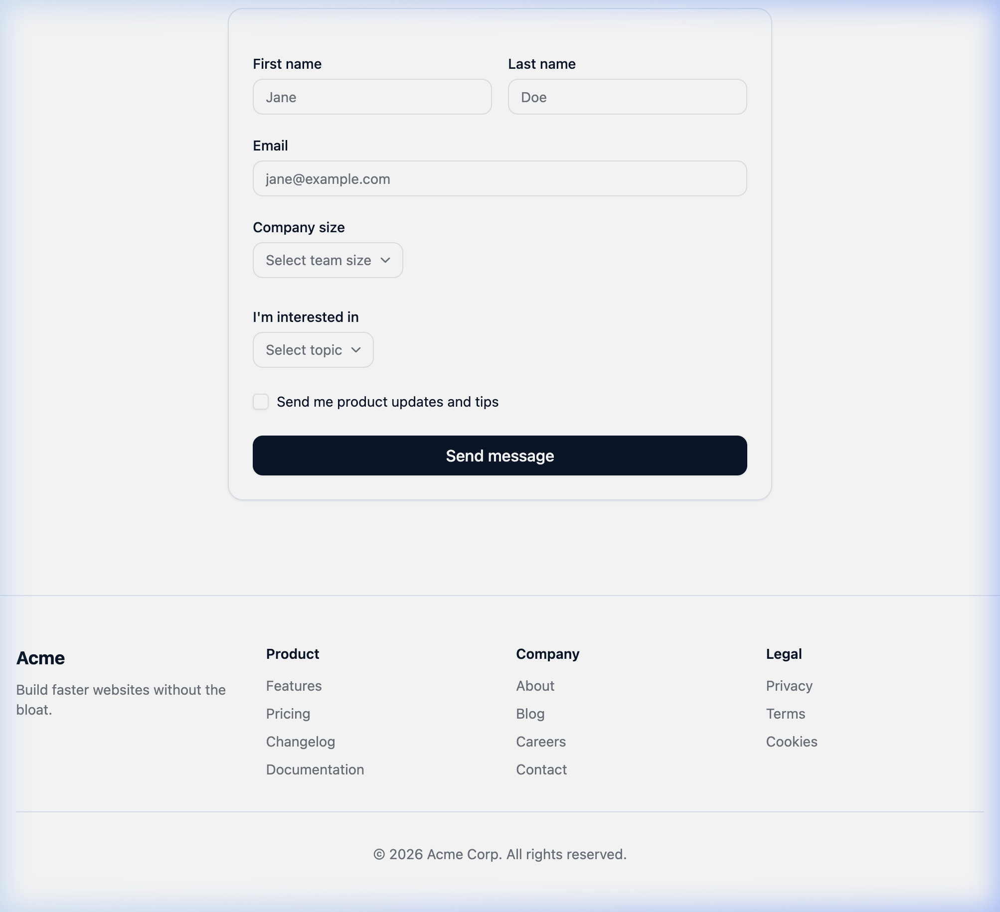
<!-- slide -->
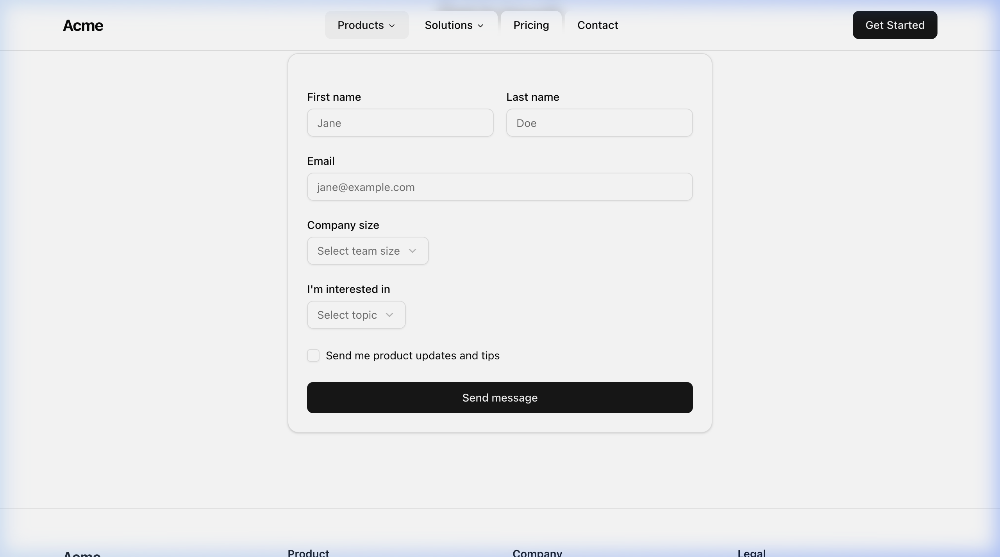
````

---

## JS Bundle Breakdown

### Astro + b/ui (7 files, 22.25 KB gzipped)

Each interactive component ships its own small JS module. Static components ship nothing.

| File | Raw | Gzipped |
|---|---|---|
| NavigationMenu (data-slot) | 18.86 KB | 6.72 KB |
| Shared index (Astro runtime) | 12.28 KB | 4.62 KB |
| Select (data-slot) | 9.24 KB | 3.67 KB |
| HoverCard (data-slot) | 6.15 KB | 2.29 KB |
| Tooltip (data-slot) | 5.09 KB | 1.98 KB |
| Tabs (data-slot) | 4.01 KB | 1.79 KB |
| Accordion (data-slot) | 2.95 KB | 1.17 KB |
| **Total** | **58.59 KB** | **22.25 KB** |

### Astro + React + shadcn (3 files, 114.47 KB gzipped)

React + Radix running inside an Astro island. No Next.js router or framework code.

| File | Raw | Gzipped |
|---|---|---|
| React/ReactDOM runtime | 178.42 KB | 56.24 KB |
| MarketingPage + Radix components | 183.67 KB | 53.93 KB |
| Astro island runtime | 11.94 KB | 4.30 KB |
| **Total** | **374.03 KB** | **114.47 KB** |

### Next.js + shadcn (10 files, 219.19 KB gzipped)

Includes React runtime, Radix UI primitives, Next.js router, and framework code.

| File | Raw | Gzipped |
|---|---|---|
| Main framework chunk | 219.36 KB | 68.48 KB |
| Next.js router chunk | 154.60 KB | 39.29 KB |
| Framework utilities | 109.96 KB | 38.70 KB |
| Page/component code | 116.67 KB | 31.01 KB |
| Hydration/RSC chunk | 72.37 KB | 24.59 KB |
| *5 smaller chunks* | 56.86 KB | 17.12 KB |
| **Total** | **729.82 KB** | **219.19 KB** |

---

## Where Does the JavaScript Come From?

```
Astro + b/ui          ████ 22.25 KB
                      └─ 6 data-slot modules + Astro runtime

Astro + React + shadcn ██████████████████████ 114.47 KB
                       └─ React (56 KB) + Radix/components (54 KB) + Astro (4 KB)

Next.js + shadcn       ████████████████████████████████████████████ 219.19 KB
                       └─ React (56 KB) + Radix/components (~54 KB)
                          + Next.js router (39 KB) + Framework (70 KB)
```

### What the Astro + React version tells us

By removing Next.js from the equation, we isolate two separate costs:

1. **React + Radix alone** costs **~114 KB gzip** — that's the minimum JS for using shadcn/ui components, regardless of framework
2. **Next.js adds ~105 KB** more on top (router, RSC, hydration, framework utils)
3. **b/ui's data-slot approach** achieves the same interactive UX for **22 KB total**, because it replaces both React AND Radix with vanilla JS primitives

---

## Why This Happens

### The hydration tax (React-based versions)

In both React-based versions, the browser must:
1. **Download** React + ReactDOM (~56 KB gzipped)
2. **Download** Radix UI primitives for each component
3. **Parse and execute** all JavaScript
4. **Hydrate** the entire component tree — even static text

### The framework tax (Next.js only)

Next.js adds additional overhead on top of React:
1. **Client-side router** — Links, prefetching, route transitions
2. **RSC infrastructure** — Server/client component reconciliation
3. **Framework utilities** — Error boundaries, loading states, metadata

### The Astro + b/ui approach

1. Static components → **pure HTML + CSS** (zero JavaScript)
2. Interactive components → **data-slot primitives** (tiny vanilla JS)
3. **No framework runtime**, no virtual DOM, no hydration
4. JavaScript loaded **only for the 6 component types** that need it

---

## Methodology

| Setting | Value |
|---|---|
| Astro version | 5.16.4 – 5.18.0 |
| Next.js version | 16.1.6 (Turbopack) |
| Build mode | Static (SSG) for all three |
| Measurement | All `.js` files in build output, gzipped programmatically |
| Viewport | 1280×800 |
| Components | 13 identical types, same count and placement |

### Reproduction

```bash
# Build all three
cd benchmarks/astro-bui && bun install && bun run build
cd benchmarks/astro-react-shadcn && npm install && npx astro build
cd benchmarks/nextjs-shadcn && npm install && npm run build

# Measure
node benchmarks/scripts/measure.mjs

# Preview production builds
cd benchmarks/astro-bui && bun run preview     # :4321
cd benchmarks/astro-react-shadcn && npx astro preview  # :4322
cd benchmarks/nextjs-shadcn && npm run start   # :3000
```

---

## Manual Testing Checklist

Run these in Chrome Incognito on the production preview servers:

- [ ] **Network tab** → Filter JS → Compare total transferred (all 3)
- [ ] **Lighthouse** → Performance audit → Compare scores (all 3)
- [ ] **Performance tab** → Record interactions → Compare INP (all 3)
- [ ] **Coverage tab** → Check % of JS actually executed vs loaded (all 3)
